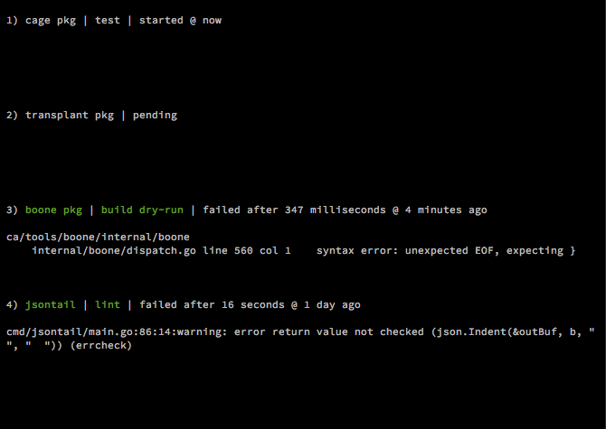
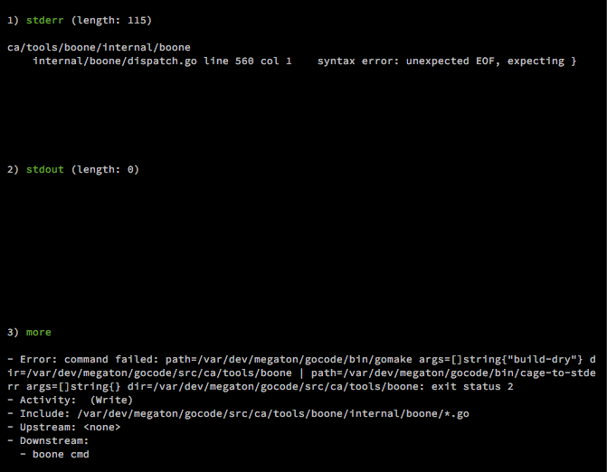
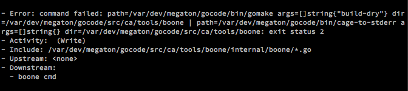

# boone [](https://pkg.go.dev/mod/github.com/codeactual/boone) [](https://goreportcard.com/report/github.com/codeactual/boone) [](https://travis-ci.org/codeactual/boone)

boone runs arbitrary commands based on file-activity and declared dependency between monitored code trees. It started as a personal CI tool, so its approach is heavily biased toward that use case even if the configuration options appear general purpose.

- Terminal-based UI focused on issues that require attention.
- Configuration of targets with glob inclusion/exclusion patterns, debounce control, multi-command sequences, pipeline commands, and target dependencies.
- No focus-stealing features, e.g. email notifications.
- Automatic cancel/restart of commands after newer file activity.

> To install: `go get -v github.com/codeactual/boone/cmd/boone`

# UI

## Global keyboard controls

- `q`: quit

## Status list



- Keyboard controls:
  - `1-9`: fullscreen view of the selected status (`Detail list`)

## Detail list



- Keyboard controls:
  - `1-3`: fullscreen view of standard error, standard output, or misc. details (`Detail view`)
  - `Backspace`: go back to `Status list`

## Detail view



- Keyboard controls:
  - `Backspace`: go back one level (`Detail list`)
  - `<j>/<down arrow>`: scroll down one line
  - `<k>/<up arrow>`: scroll up one line
  - `<ctrl-f>/<page down>`: scroll down one page
  - `<ctrl-b>/<page up>`: scroll up one page

# Configuration

## Glob patterns

All `Include` and `Exclude` glob patterns are converted to concrete paths using `[doublestar](https://github.com/bmatcuk/doublestar)`. Patterns must be relative to `Target.Root` paths.

Examples:

- Match all Go files at any depth under a top-level `cmd` directory: `'cmd/**/*.go'`
- Match directories named `subdir` at any depth and all their contents recursively: use both `'**/subdir'` and `'**/subdir/**/*'`
- Match dot-prefixed directories at any depth and all their contents recursively: use both `'**/.*'` and `'**/.*/**/*'`

## Quick example

```yaml
Template:
  go_src_root: '/path/to/src'
Global:
  # Don't watch these files for any target.
  Exclude:
    # Test fixtures
    - Glob: '**/fixture'
    - Glob: '**/fixture/**/*'
    # Third-party dependencies
    - Glob: '**/vendor'
    - Glob: '**/vendor/**/*'
Target:
  # target: files related to building the API used by the CLI
  - Label: 'my_project api'
    Id: 'my_project api'
    Root: '{{.go_src_root}}/tools/my_project'
    Include:
      - Glob: 'lib/**/*.go'
      - Glob: 'models/**/*.go'
    Exclude:
      # Dot-prefixed dirs
      - Glob: '**/.*'
      - Glob: '**/.*/**/*'
      # Generated mock implementations
      - Glob: '**/mocks'
      - Glob: '**/mocks/**/*'
    Handler:
      # check for compilation errors (fastest)
      - Label: 'build dry-run'
        Exec:
          - Cmd: 'make build-dry'
      # check for test failures
      - Label: 'test'
        Exec:
          - Cmd: 'make test-api'
      # check for lint failures (slowest)
      - Label: 'lint'
        Exec:
          - Cmd: 'make lint-api'
  # target: files related to building the CLI
  - Label: 'my_project cmd'
    Upstream:
      - 'my_project api'
    Root: '{{.go_src_root}}/tools/my_project'
    Include:
      - Glob: 'cmd/**/*.go'
    Handler:
      # check for compilation errors (fastest)
      - Label: 'build dry-run'
        Exec:
          - Cmd: 'make build-dry'
      # check for test failures
      - Label: 'test'
        Exec:
          - Cmd: 'make test-cmd'
      # check for lint failures (slowest)
      - Label: 'lint'
        Exec:
          - Cmd: 'make lint-cmd'
```

## Reference

These references are organized by the top-level configuration sections.

### `Data`

> Choose where to store program state.

- Optional

```yaml
Data:
  # Status lists will optionally be saved at shutdown and restored at startup.
  # - Optional
  Session:
    # State file location.
    # - Optional
    File: '/path/to/session'
```

> Reduce typos by defining key/value string pairs to access with {{.name}} syntax in any text field.

- Optional
- Field values must be single/double-quoted to use the variable syntax.
- See the "Template variable availablility" section for more details.

### `Template`

```yaml
Template:
  go_src_root: '/path/to/src'
  faster_than_default_debounce: '10s'
  longer_than_default_timeout: '20m'
  # ...
```

### `AutoStartTarget`

> Run these targets when the program starts.

- Optional
- Each value is a Target.Id string.

```yaml
AutoStartTarget:
  - 'cache'
```

### `Global`

> Set behavior for all targets.

- Optional

```yaml
Global:
  # How long to wait after one command finishes before starting another.
  # - Optional (default: '5s')
  # - Valid time units are 'ns', 'us' (or 'µs'), 'ms', 's', 'm', 'h'. (https://golang.org/pkg/time/#ParseDuration)
  Cooldown: '10s'
  # Add these Exclude items to every target's Exclude list. Exclude.Root values cannot be defined here,
  # but they will default to each associated Target.Root.
  # - Optional
  Exclude:
    # - Required
    # - See the separate "Glob patterns" documentation section for more details.
    - Glob: ''
    # ...
```

### `Target`

> Each target defines one or more commands to run when a watched directory receives a file or a watched
> file receives a write. Deletion-based activation is currently not supported.

- Required
- Entity summary:
  - Use an `Exec` to define an individual command.
  - Use a `Handler` to make a logical sequence of commands from one or more `Exec` definitions.
  - Use `Target` to map a set of file `Include/Exclude` file/directory path patterns to one or more `Handler` definitions.

```yaml
Target:
  # Example: this target exercises all available options except Upstream.
  #
  # Label selects how the target is represented in the UI. While the Id field's purpose is addressing,
  # the Label field only supports readability.
  # - Required
  - Label: 'demo all options'
    # Common prefix/base for Include/Exclude file patterns.
    # - Required (if Include/Exclude lists are defined)
    Root: '{{.go_src_root}}/path/to/target/root'
    # How long to wait for file activity to stop before running the target (or enqueuing it
    # if another target is currently running).
    # - Optional (default: '15s')
    # - Valid time units are 'ns', 'us' (or 'µs'), 'ms', 's', 'm', 'h'. (https://golang.org/pkg/time/#ParseDuration)
    Debounce: '{{.faster_than_default_debounce}}'
    # - Uniquely identify this target for use in lists such as AutoStartTargets and Upstream.
    # - Optional
    # - If no other sections must refer to this target, the Id field can be omitted.
    Id: 'kitchen sink'
    # Execute the target's commands if an active file/directory's path matches at least one Include.Glob
    # and no Exclude.Glob.
    # - Optional
    Include:
        # Execute the target's commands if any file/directory, matching this pattern, receives activity.
        # - Required
        # - See the separate "Glob patterns" documentation section for more details.
      - Glob: ''
        # Override the default prefix for Glob, Target.Root.
        # - Optional
        Root: '/path/prefix/for/glob'
      # ...
    # Execute the target's commands if an active file/directory's path matches at least one Include.Glob
    # and no Exclude.Glob.
    # - Optional
    Exclude:
        # - Required
        # - See the separate "Glob patterns" documentation section for more details.
      - Glob: ''
        # Override the default prefix for Glob, Target.Root.
        # - Optional
        Root: '/path/prefix/for/glob'
      # ...
    # Each handler defines one or more commands to execute after file activity.
    # - Required
    # - Handlers execute in their declared order.
    Handler:
        # Label selects how the target is represented in the UI. It only supports readability.
        # - Required
      - Label: ''
        # Exec selects the commands this handler executes.
        # - Required
        # - Commands execute in their declared order.
        Exec:
          # Cmd defines the program and arguments to execute.
          # - Required
          # - See the separate "Commands" documentation section for more details about what's supported.
          - Cmd: ''
            # Customize the working directory.
            # - Optional
            Dir: ''
            # How long to wait for file activity to stop before running the target (or enqueuing it
            # - Optional (default: '10m')
            # - Valid time units are 'ns', 'us' (or 'µs'), 'ms', 's', 'm', 'h'. (https://golang.org/pkg/time/#ParseDuration)
            Timeout: '{{.longer_than_default_timeout}}'
            # Add/overwrite environment variable keypairs.
            # - Optional
            Env:
              - 'KEY1=VAL1'
              # ...
          # ...
      # ...
  # Example: this target is executed based on its watched file patterns and also if one of its Upstream targets executed.
  #
  # Label selects how the target is represented in the UI. While the Id field's purpose is addressing,
  # the Label field only supports readability.
  # - Required
  - Label: 'after all-option demo or after own file activity'
    # - Uniquely identify this target for use in lists such as AutoStartTargets and Upstream.
    # - Optional
    # - If no other sections must refer to this target, the Id field can be omitted.
    Id: 'downstream demo'
    # After any target in this list finishes running, automatically enqueue this target to also run.
    # - Optional
    # - All values must be dependencies' Target.Id values.
    Upstream:
      - 'kitchen sink'
    # Execute the target's commands if an active file/directory's path matches at least one Include.Glob
    # and no Exclude.Glob.
    # - Optional
    Include:
        # Execute the target's commands if any file/directory, matching this pattern, receives activity.
        # - Required
        # - See the separate "Glob patterns" documentation section for more details.
      - Glob: ''
      # ...
    # Each handler defines one or more commands to execute after file activity.
    # - Required
    # - Handlers execute in their declared order.
    Handler:
        # Label selects how the target is represented in the UI. It only supports readability.
        # - Required
      - Label: ''
        # Exec selects the commands this handler executes.
        # - Required
        # - Commands execute in their declared order.
        Exec:
            # Cmd defines the program and arguments to execute.
            # - Required
            # - See the separate "Commands" documentation section for more details about what's supported.
          - Cmd: ''
          # ...
      # ...
  # Example: this target is only executed via AutoStartTarget.
  #
  # It could also define Include patterns in order to run both at startup and based on file activity
  # (in which case a Root path would be required).
  #
  # Label selects how the target is represented in the UI. While the Id field's purpose is addressing,
  # the Label field only supports readability.
  # - Required
  - Label: 'pre-warm caches'
    # - Uniquely identify this target for use in lists such as AutoStartTargets and Upstream.
    # - Optional
    # - If no other sections must refer to this target, the Id field can be omitted.
    Id: 'cache'
    # Each handler defines one or more commands to execute after file activity.
    # - Required
    # - Handlers execute in their declared order.
    Handler:
        # Label selects how the target is represented in the UI. It only supports readability.
        # - Required
      - Label: ''
        # Exec selects the commands this handler executes.
        # - Required
        # - Commands execute in their declared order.
        Exec:
            # Cmd defines the program and arguments to execute.
            # - Required
            # - See the separate "Commands" documentation section for more details about what's supported.
          - Cmd: ''
          # ...
      # ...
```

## File activity detection

A target's commands execute if:

- An `Include.Glob` matches a file that receives a write or matches a directory which receives a new file. Deletion-based activation is currently not supported.
- And the file/directory path matches no `Exclude.Glob` pattern.

If new file/directory is created after startup, and it satisfies the above conditions, then it will be added to the watched set.

## Commands

`Target.Handler.Exec.Cmd` strings:

- Support environment variables.
- Support `|` pipelines in a `[pipefail](https://www.gnu.org/software/bash/manual/html_node/Pipelines.html)`-like mode where if any individual command fails then the whole pipeline is considered a failure.

## Template variable availablility

- Key/value pairs in the `Template` config section are available in:
  - `Target.Debounce`
  - `Target.Root`
  - `Target.Handler.Exec.Cmd`
  - `Target.Handler.Exec.Dir`
  - `Target.Handler.Exec.Timeout`
- `Target.Handler.Exec.Cmd` can access these additional variables:
  - `Dir`: absolute path to the directory of the file activity
  - `HandlerLabel`: copy of `Target.Handler.Label`
  - `IncludeGlob`: `Glob` of the `Include` that matched against the file activity
  - `IncludeRoot`: `Root` of the `Include` that matched against the file activity
  - `Path`: absolute path to the active file
  - `TargetLabel`: copy of `Target.Label`

# Runtime

## File activity lifecycle

1. Detect that a watched file has received a write or a watch directory has received a new file. Deletion-based activation is currently not supported.
1. Wait until target activity has stopped for `Target.Debounce` amount of time, enqueue the target to run, display it in the UI with a `pending` status.
1. Run all of the target's handlers serially in declared order, running each handler's command list serially in declared order. Display the target in the UI as `started`.
1. If target file activity occurs while the target's commands are running, kill the running command and cancel any that were pending. Start the above sequence again.
1. After running a command, sleep for `Global.Cooldown` amount of time before starting the next.
1. If the command fails, display the target in the UI as `failed`. If it succeeds, remove it from the UI.
1. If the program is shutdown cleanly before a target's command list finishes, enqueue it to run again at startup (if `Data.Session.File` is set).
1. After running all of target's commands, run all downstream targets (those with the current target's Id in their `Upstream` list).

# Development

## License

[Mozilla Public License Version 2.0](https://www.mozilla.org/en-US/MPL/2.0/) ([About](https://www.mozilla.org/en-US/MPL/), [FAQ](https://www.mozilla.org/en-US/MPL/2.0/FAQ/))

## Contributing

- Please feel free to submit issues, PRs, questions, and feedback.
- Although this repository consists of snapshots extracted from a private monorepo using [transplant](https://github.com/codeactual/transplant), PRs are welcome. Standard GitHub workflows are still used.
